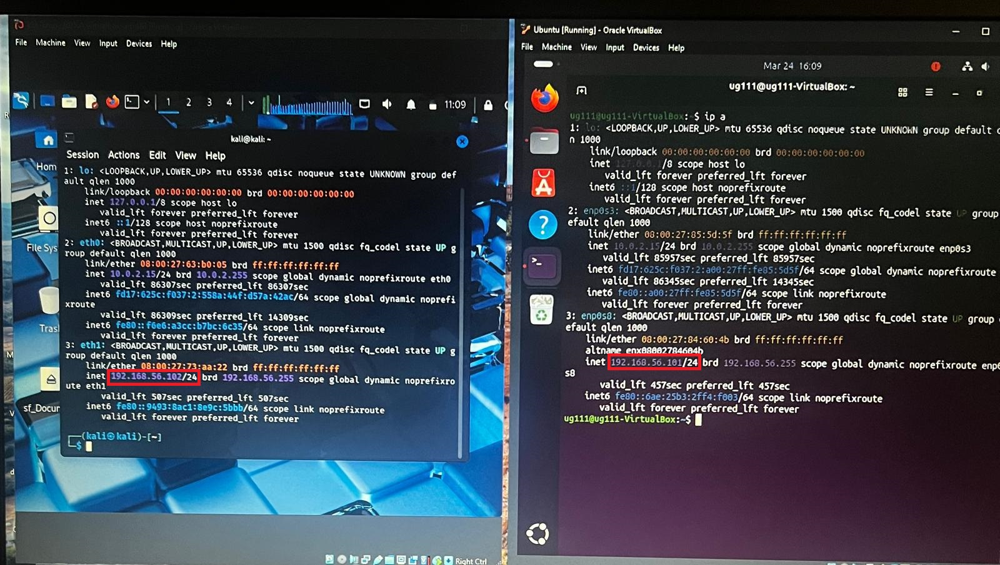
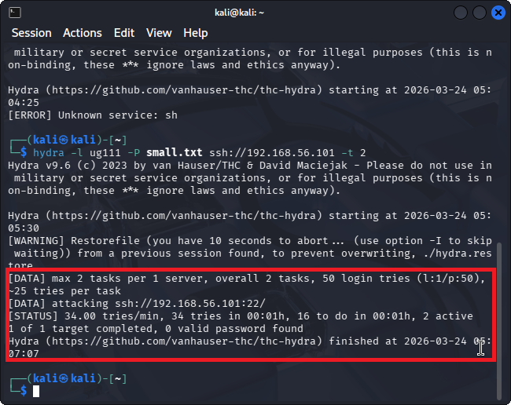
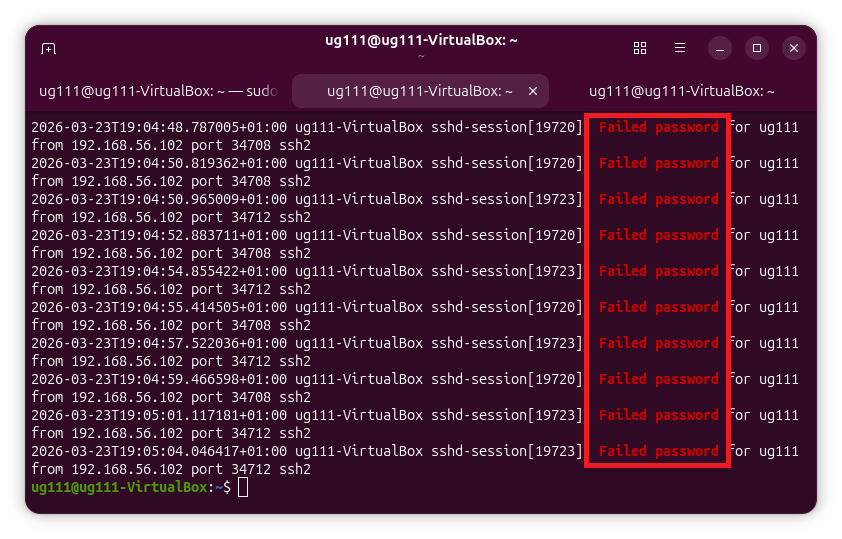
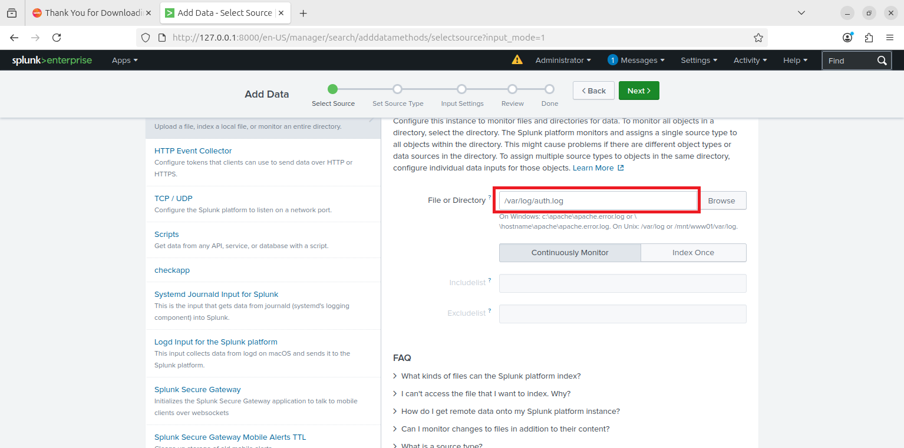
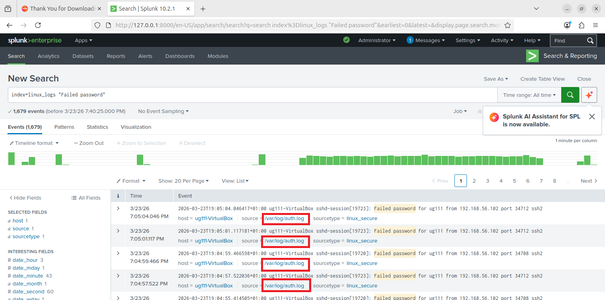
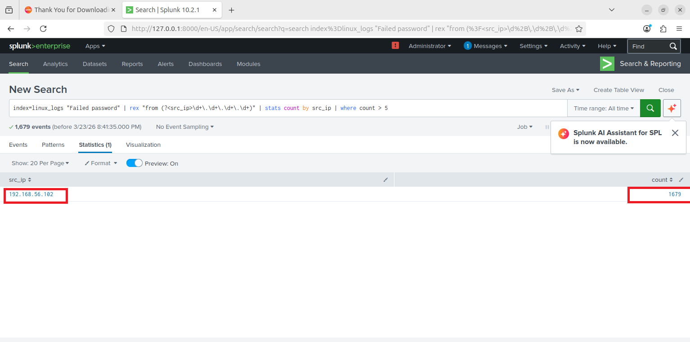
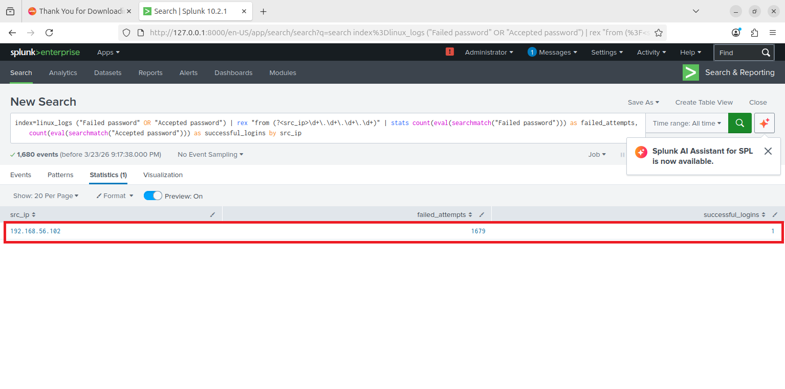
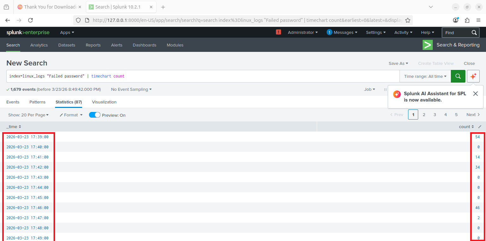

# 🔐 SSH Brute-Force Detection Lab (Splunk SIEM)

## 👨‍💻 Author
Ugochukwu Iwuoha  

---

## 📌 Project Overview

This project simulates and detects an SSH brute-force attack in a controlled lab environment **Kali linux & Ubuntu VM** using **Splunk SIEM**.

The objective of this lab is to demonstrate how security analysts can:
- Detect brute-force login attempts
- Identify attacker source IP
- Correlate failed and successful login events
- Investigate potential system compromise

---

## 🚨 Problem Statement

Brute-force attacks on SSH services are a common entry point for attackers to gain access to systems.  
Without proper monitoring and detection, repeated failed login attempts may go unnoticed until a successful compromise occurs.

This project addresses:
- Detection of repeated failed login attempts
- Identification of suspicious login behavior
- Detection of successful compromise following repeated brute-force attempts

---

## 🧪 Lab Tools Used

| Component | Role |
|----------|------|
| Kali Linux | Attacker machine |
| Ubuntu | Target system |
| Splunk Enterprise | SIEM for log analysis |
| Hydra | Brute-force simulation


---
## 🚦 SSH Service Verification
Verification lab environment with attacker  (Kali Linux) and target (Ubuntu)

## ⚔️ Attack Scenario

A brute-force attack was simulated using multiple failed login attempts

```bash
hydra -l <username> -P small.txt ssh://<target-ip> -t 2

```


## 🏮Log Evidence

- Logs show reppeated "Failed password" attempts from a single IP.
- Authentication logs were recorded in `/var/log/auth.log`

---


## 📥 Log Ingestion

Logs were ingested into Splunk by monitoring:


```
/var/log/auth.log
```

This enabled real-time analysis of authentication events.

---

### 🔍 Detection Logic

This output shows a source IP with:
- multiple failed login attempts
- At least one successful login
  
### 1️⃣ Failed Login Detection

```spl
index=linux_logs "Failed password"
| rex "from (?<src_ip>\d+\.\d+\.\d+\.\d+)"
| stats count by src_ip
| sort -count
```



This identifies source IPs generating multiple failed login attempts.

---

### 2️⃣ Threshold-Based Detection
The following query identifies multiple failed SSH login attempts
```spl
index=linux_logs "Failed password"
| rex "from (?<src_ip>\d+\.\d+\.\d+\.\d+)"
| stats count as failed_attempts by src_ip
| where failed_attempts > 5
```



Flags IPs exceeding a defined threshold of failed attempts.

---

### 3️⃣ Correlation of Failed and Successful Logins
This screenshot shows the coreelation between multiple failedSSH login
attempts follwoed by a successful login, indicating a possible brute-force
attack
```spl
index=linux_logs ("Failed password" OR "Accepted password")
| rex "from (?<src_ip>\d+\.\d+\.\d+\.\d+)"
| stats count(eval(searchmatch("Failed password"))) as failed_attempts,
count(eval(searchmatch("Accepted password"))) as successful_logins by src_ip
```



---


## 📊 Key Findings

- A single source IP generated **1679 failed login attempts**
- The same IP later achieved **successful authentication**
- This indicates a **successful brute-force compromise**

---

## ⚠️ Security Insight

This scenario demonstrates:

- Attackers can persist through repeated login attempts
- Weak credentials increase risk of compromise
- Monitoring failed logins alone is not sufficient
- Correlation of events is critical for detection

---

## 📈 Visualization

A time-based analysis was performed to observe spikes in login attempts:
```spl
index=linux_logs "Failed password"
| timechart count
```
This highlights attack intensity over time.
The unrelenting nature of brute-force attacks
demonstrates how attackers persistently attempt
multiple credential combinations without backing down.

---


## 🧠 Skills Demonstrated

- SIEM log ingestion (Splunk)
- Attack simulation and analysis
- Log analysis and parsing
- Regex-based field extraction
- Detection engineering
- Security event correlation
- Incident investigation

---

## 🚀 Future Improvements

- Implement alerting in Splunk for brute-force detection
- Integrate machine learning for anomaly detection
- Improve threshold tuning to reduce false positives
- Expand to network-level monitoring

---

## 📸 Screenshots

1  Lab Environment Setup  
2. SSH Service Verification  
3. Hydra Attack Execution  
4. Attack Progress  
5. Log Evidence on Ubuntu  
6. Splunk Data Input Configuration  
7. Raw Logs in Splunk  
8. Detection Query Output  
9. Successful Login Detection  
10. Attack Timeline Visualization  
11. Correlation of Failed and Successful Attempts  

---

## Analyst Notes

- The activity indicates a brute-force attack
- The successful login suggests compromise
- Recommend action:
   - Block source IP
   - Investigate affected account
## 🔗 Conclusion

This project demonstrates a full SOC workflow:
Attack Simulation → Log Collection → Detection → Correlation → Investigation → Insight
It highlights how attackers can move from repeated failed attempts to successful compromise, 
and how proper detection logic can identify this behavior early.
This reflects real-world  security monitoring practices used in modern SOC environments.

